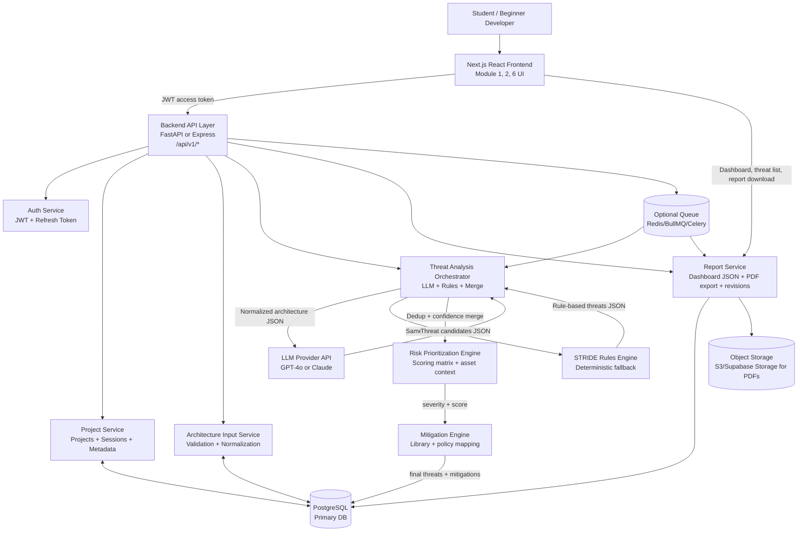

# AI Threat Modeling Assistant — Production Blueprint

## A) System Architecture Diagram



### Module interaction narrative
1. **User & project management (Module 1)** handles signup/login, refresh tokens, and project metadata.
2. **Architecture input module (Module 2)** captures multi-step architecture details, validates shape, and stores an immutable revision.
3. **Threat analysis engine (Module 3)** sends normalized JSON to both LLM and rules engine in parallel.
4. **Risk prioritization module (Module 4)** computes deterministic scores from impact, likelihood, sensitivity, and exploitability evidence.
5. **Mitigation recommendation module (Module 5)** enriches each threat with plain-language mitigation actions.
6. **Report & dashboard module (Module 6)** renders current analysis, supports revision history, and exports PDF/JSON.

> Note: Run the LLM and rules engine in parallel and always merge results; this ensures the platform still works when LLM output is partial, malformed, or rate-limited.

> Note: Use asynchronous jobs for heavy tasks (analysis + PDF generation) to keep beginner user experience fast and responsive.

---

## B) Database Schema (Relational — PostgreSQL)

```sql
-- USERS AND AUTH
CREATE TABLE users (
  id UUID PRIMARY KEY DEFAULT gen_random_uuid(),
  email VARCHAR(320) UNIQUE NOT NULL,
  password_hash TEXT NOT NULL,
  full_name VARCHAR(120) NOT NULL,
  role VARCHAR(30) NOT NULL DEFAULT 'user', -- user, admin
  is_active BOOLEAN NOT NULL DEFAULT TRUE,
  created_at TIMESTAMPTZ NOT NULL DEFAULT NOW(),
  updated_at TIMESTAMPTZ NOT NULL DEFAULT NOW()
);

CREATE TABLE refresh_tokens (
  id UUID PRIMARY KEY DEFAULT gen_random_uuid(),
  user_id UUID NOT NULL REFERENCES users(id) ON DELETE CASCADE,
  token_hash TEXT NOT NULL,
  expires_at TIMESTAMPTZ NOT NULL,
  revoked_at TIMESTAMPTZ,
  created_at TIMESTAMPTZ NOT NULL DEFAULT NOW(),
  user_agent TEXT,
  ip_address INET
);

-- PROJECTS AND SESSIONS
CREATE TABLE projects (
  id UUID PRIMARY KEY DEFAULT gen_random_uuid(),
  owner_user_id UUID NOT NULL REFERENCES users(id) ON DELETE CASCADE,
  name VARCHAR(160) NOT NULL,
  description TEXT,
  domain VARCHAR(80), -- fintech, healthcare, ecommerce, etc.
  architecture_type VARCHAR(60), -- monolith, microservices, serverless
  deployment_model VARCHAR(60), -- cloud, hybrid, on-prem
  status VARCHAR(30) NOT NULL DEFAULT 'draft', -- draft, analyzed, archived
  latest_session_id UUID,
  created_at TIMESTAMPTZ NOT NULL DEFAULT NOW(),
  updated_at TIMESTAMPTZ NOT NULL DEFAULT NOW()
);

CREATE TABLE project_members (
  id UUID PRIMARY KEY DEFAULT gen_random_uuid(),
  project_id UUID NOT NULL REFERENCES projects(id) ON DELETE CASCADE,
  user_id UUID NOT NULL REFERENCES users(id) ON DELETE CASCADE,
  access_level VARCHAR(20) NOT NULL DEFAULT 'viewer', -- owner, editor, viewer
  created_at TIMESTAMPTZ NOT NULL DEFAULT NOW(),
  UNIQUE(project_id, user_id)
);

CREATE TABLE analysis_sessions (
  id UUID PRIMARY KEY DEFAULT gen_random_uuid(),
  project_id UUID NOT NULL REFERENCES projects(id) ON DELETE CASCADE,
  version_no INT NOT NULL,
  input_checksum CHAR(64) NOT NULL,
  trigger_type VARCHAR(30) NOT NULL DEFAULT 'manual', -- manual, auto
  status VARCHAR(30) NOT NULL DEFAULT 'queued', -- queued, processing, completed, failed
  llm_provider VARCHAR(40), -- openai, anthropic
  llm_model VARCHAR(60),
  started_at TIMESTAMPTZ,
  completed_at TIMESTAMPTZ,
  error_message TEXT,
  created_by UUID NOT NULL REFERENCES users(id),
  created_at TIMESTAMPTZ NOT NULL DEFAULT NOW(),
  UNIQUE(project_id, version_no)
);

-- ARCHITECTURE INPUT
CREATE TABLE architecture_inputs (
  id UUID PRIMARY KEY DEFAULT gen_random_uuid(),
  session_id UUID NOT NULL UNIQUE REFERENCES analysis_sessions(id) ON DELETE CASCADE,
  system_name VARCHAR(160) NOT NULL,
  architecture_json JSONB NOT NULL,
  trust_boundaries_json JSONB NOT NULL,
  data_flows_json JSONB NOT NULL,
  assumptions_json JSONB,
  created_at TIMESTAMPTZ NOT NULL DEFAULT NOW()
);

-- THREATS
CREATE TABLE threats (
  id UUID PRIMARY KEY DEFAULT gen_random_uuid(),
  session_id UUID NOT NULL REFERENCES analysis_sessions(id) ON DELETE CASCADE,
  source VARCHAR(20) NOT NULL, -- llm, rules, merged
  threat_name VARCHAR(180) NOT NULL,
  stride_category VARCHAR(30) NOT NULL, -- Spoofing/Tampering/Repudiation/Information Disclosure/Denial of Service/Elevation of Privilege
  affected_component VARCHAR(180) NOT NULL,
  description TEXT NOT NULL,
  evidence TEXT,
  impact_score SMALLINT NOT NULL CHECK (impact_score BETWEEN 1 AND 5),
  likelihood_score SMALLINT NOT NULL CHECK (likelihood_score BETWEEN 1 AND 5),
  asset_sensitivity_score SMALLINT NOT NULL CHECK (asset_sensitivity_score BETWEEN 1 AND 5),
  exploitability_score SMALLINT NOT NULL CHECK (exploitability_score BETWEEN 1 AND 5),
  risk_score NUMERIC(5,2) NOT NULL,
  severity VARCHAR(20) NOT NULL, -- Critical/High/Medium/Low
  confidence_score NUMERIC(5,2) NOT NULL DEFAULT 0.70,
  status VARCHAR(20) NOT NULL DEFAULT 'open', -- open, accepted, mitigated, false_positive
  created_at TIMESTAMPTZ NOT NULL DEFAULT NOW(),
  updated_at TIMESTAMPTZ NOT NULL DEFAULT NOW()
);

CREATE TABLE threat_tags (
  id UUID PRIMARY KEY DEFAULT gen_random_uuid(),
  threat_id UUID NOT NULL REFERENCES threats(id) ON DELETE CASCADE,
  tag VARCHAR(60) NOT NULL
);

-- MITIGATIONS
CREATE TABLE mitigations (
  id UUID PRIMARY KEY DEFAULT gen_random_uuid(),
  threat_id UUID NOT NULL REFERENCES threats(id) ON DELETE CASCADE,
  title VARCHAR(180) NOT NULL,
  recommendation TEXT NOT NULL,
  priority VARCHAR(20) NOT NULL DEFAULT 'p2', -- p1, p2, p3
  effort VARCHAR(20) NOT NULL DEFAULT 'medium', -- low, medium, high
  owner_hint VARCHAR(80), -- backend, devops, frontend
  references_json JSONB,
  created_at TIMESTAMPTZ NOT NULL DEFAULT NOW()
);

-- REPORTS
CREATE TABLE reports (
  id UUID PRIMARY KEY DEFAULT gen_random_uuid(),
  session_id UUID NOT NULL REFERENCES analysis_sessions(id) ON DELETE CASCADE,
  format VARCHAR(20) NOT NULL, -- json, pdf
  summary_json JSONB NOT NULL,
  file_url TEXT,
  generated_by UUID NOT NULL REFERENCES users(id),
  created_at TIMESTAMPTZ NOT NULL DEFAULT NOW()
);

CREATE TABLE report_revisions (
  id UUID PRIMARY KEY DEFAULT gen_random_uuid(),
  project_id UUID NOT NULL REFERENCES projects(id) ON DELETE CASCADE,
  report_id UUID NOT NULL REFERENCES reports(id) ON DELETE CASCADE,
  revision_no INT NOT NULL,
  notes TEXT,
  created_by UUID NOT NULL REFERENCES users(id),
  created_at TIMESTAMPTZ NOT NULL DEFAULT NOW(),
  UNIQUE(project_id, revision_no)
);

-- OPTIONAL RULE LIBRARY FOR FALLBACK ENGINE
CREATE TABLE threat_rules (
  id UUID PRIMARY KEY DEFAULT gen_random_uuid(),
  rule_key VARCHAR(100) UNIQUE NOT NULL,
  title VARCHAR(180) NOT NULL,
  stride_category VARCHAR(30) NOT NULL,
  condition_json JSONB NOT NULL,
  default_description TEXT NOT NULL,
  default_mitigation TEXT NOT NULL,
  enabled BOOLEAN NOT NULL DEFAULT TRUE,
  created_at TIMESTAMPTZ NOT NULL DEFAULT NOW(),
  updated_at TIMESTAMPTZ NOT NULL DEFAULT NOW()
);
```

### Key relationships
- `users 1..* projects` via `owner_user_id`.
- `projects 1..* analysis_sessions` (versioned analysis history).
- `analysis_sessions 1..1 architecture_inputs`.
- `analysis_sessions 1..* threats`.
- `threats 1..* mitigations`.
- `analysis_sessions 1..* reports` and `projects 1..* report_revisions`.

> Note: `architecture_json` keeps full flexibility for evolving architecture form fields without frequent migrations.

---

## C) LLM Prompt Engineering (Deterministic JSON)

### 1) System Prompt (exact)

```text
You are ThreatModelJSON, a secure software threat analysis engine.
Your task is to analyze a provided application architecture JSON and output ONLY valid JSON that exactly matches the required schema.

Hard requirements:
1) Output must be valid minified or pretty JSON (no markdown, no prose, no code fences).
2) Return an object with one key: "threats".
3) "threats" must be an array. Each item must include ALL fields:
   - threat_name (string)
   - category (string, one of: "Spoofing", "Tampering", "Repudiation", "Information Disclosure", "Denial of Service", "Elevation of Privilege")
   - affected_component (string)
   - severity (string, one of: "Critical", "High", "Medium", "Low")
   - description (string, plain language for students)
   - mitigation (string, plain language and actionable)
4) Every threat must map to exactly one STRIDE category.
5) Descriptions and mitigations must be beginner-friendly, concrete, and short (1-3 sentences each).
6) Do not include duplicate threats for the same component and same root cause.
7) If input is incomplete, infer cautiously and still return best-effort threats.
8) If no meaningful threats are found, return {"threats": []}.
9) Never output any keys besides "threats" and the six fields above.
10) Never include null values.

Severity guidance:
- Critical: direct compromise of sensitive data, payments, or admin control is likely.
- High: serious risk with realistic exploitation path.
- Medium: moderate impact or requires specific conditions.
- Low: limited impact or hard to exploit.

You must follow the schema exactly.
```

### 2) User Message Template (exact)

```text
Analyze this architecture JSON and produce threats in the required JSON schema.

Architecture JSON:
{{ARCHITECTURE_JSON}}
```

### 3) Required JSON Schema (backend validation)

```json
{
  "$schema": "https://json-schema.org/draft/2020-12/schema",
  "type": "object",
  "additionalProperties": false,
  "required": ["threats"],
  "properties": {
    "threats": {
      "type": "array",
      "items": {
        "type": "object",
        "additionalProperties": false,
        "required": [
          "threat_name",
          "category",
          "affected_component",
          "severity",
          "description",
          "mitigation"
        ],
        "properties": {
          "threat_name": { "type": "string", "minLength": 3, "maxLength": 180 },
          "category": {
            "type": "string",
            "enum": [
              "Spoofing",
              "Tampering",
              "Repudiation",
              "Information Disclosure",
              "Denial of Service",
              "Elevation of Privilege"
            ]
          },
          "affected_component": { "type": "string", "minLength": 2, "maxLength": 180 },
          "severity": {
            "type": "string",
            "enum": ["Critical", "High", "Medium", "Low"]
          },
          "description": { "type": "string", "minLength": 12, "maxLength": 500 },
          "mitigation": { "type": "string", "minLength": 12, "maxLength": 500 }
        }
      }
    }
  }
}
```

### 4) Backend guardrails for deterministic parsing

```ts
// pseudo-code
const llmResponse = callLLM(systemPrompt, userTemplateFilled, { temperature: 0, top_p: 1 });
const parsed = safeJsonParse(llmResponse);
if (!parsed || !validateWithJsonSchema(parsed)) {
  // fallback to rules engine output only
  return buildThreatResultFromRules();
}
return parsed;
```

> Note: Always run JSON Schema validation server-side even when model supports structured output.

---

## D) API Design (REST, versioned, JWT + refresh)

```yaml
openapi: 3.1.0
info:
  title: AI Threat Modeling Assistant API
  version: 1.0.0
servers:
  - url: /api/v1

paths:
  /auth/register:
    post:
      summary: Register a new user
      requestBody:
        required: true
        content:
          application/json:
            schema:
              type: object
              required: [email, password, full_name]
              properties:
                email: { type: string, format: email }
                password: { type: string, minLength: 8 }
                full_name: { type: string }
      responses:
        '201': { description: User created }
        '409': { description: Email already exists }

  /auth/login:
    post:
      summary: Login and receive access/refresh tokens
      requestBody:
        required: true
        content:
          application/json:
            schema:
              type: object
              required: [email, password]
              properties:
                email: { type: string, format: email }
                password: { type: string }
      responses:
        '200':
          description: Login success
          content:
            application/json:
              schema:
                type: object
                properties:
                  access_token: { type: string }
                  refresh_token: { type: string }
                  expires_in: { type: integer }
        '401': { description: Invalid credentials }

  /auth/refresh:
    post:
      summary: Refresh access token
      requestBody:
        required: true
        content:
          application/json:
            schema:
              type: object
              required: [refresh_token]
              properties:
                refresh_token: { type: string }
      responses:
        '200': { description: New access token issued }
        '401': { description: Invalid/expired refresh token }

  /auth/logout:
    post:
      summary: Revoke refresh token
      security: [{ bearerAuth: [] }]
      responses:
        '204': { description: Logged out }

  /users/me:
    get:
      summary: Current user profile
      security: [{ bearerAuth: [] }]
      responses:
        '200': { description: Profile returned }

  /projects:
    get:
      summary: List projects for current user
      security: [{ bearerAuth: [] }]
      responses:
        '200': { description: Projects list }
    post:
      summary: Create project
      security: [{ bearerAuth: [] }]
      requestBody:
        required: true
        content:
          application/json:
            schema:
              type: object
              required: [name, domain, architecture_type, deployment_model]
              properties:
                name: { type: string }
                description: { type: string }
                domain: { type: string }
                architecture_type: { type: string }
                deployment_model: { type: string }
      responses:
        '201': { description: Project created }

  /projects/{projectId}:
    get:
      summary: Get project detail
      security: [{ bearerAuth: [] }]
      responses:
        '200': { description: Project detail }
        '404': { description: Not found }
    patch:
      summary: Update project metadata
      security: [{ bearerAuth: [] }]
      responses:
        '200': { description: Project updated }
    delete:
      summary: Soft-delete/archive project
      security: [{ bearerAuth: [] }]
      responses:
        '204': { description: Project archived }

  /projects/{projectId}/sessions:
    get:
      summary: List analysis sessions (revision history)
      security: [{ bearerAuth: [] }]
      responses:
        '200': { description: Sessions returned }
    post:
      summary: Submit architecture input and start analysis
      security: [{ bearerAuth: [] }]
      requestBody:
        required: true
        content:
          application/json:
            schema:
              $ref: '#/components/schemas/ArchitectureInput'
      responses:
        '202': { description: Analysis queued }

  /projects/{projectId}/sessions/{sessionId}:
    get:
      summary: Get analysis session status/result summary
      security: [{ bearerAuth: [] }]
      responses:
        '200': { description: Session detail }

  /projects/{projectId}/sessions/{sessionId}/threats:
    get:
      summary: Get threats for a session
      security: [{ bearerAuth: [] }]
      parameters:
        - in: query
          name: severity
          schema: { type: string, enum: [Critical, High, Medium, Low] }
      responses:
        '200': { description: Threat list returned }

  /projects/{projectId}/sessions/{sessionId}/threats/{threatId}:
    patch:
      summary: Update threat status or analyst notes
      security: [{ bearerAuth: [] }]
      responses:
        '200': { description: Threat updated }

  /projects/{projectId}/sessions/{sessionId}/mitigations:
    get:
      summary: List mitigations for session threats
      security: [{ bearerAuth: [] }]
      responses:
        '200': { description: Mitigations returned }

  /projects/{projectId}/sessions/{sessionId}/reports:
    post:
      summary: Generate report (json/pdf)
      security: [{ bearerAuth: [] }]
      requestBody:
        required: true
        content:
          application/json:
            schema:
              type: object
              required: [format]
              properties:
                format: { type: string, enum: [json, pdf] }
      responses:
        '202': { description: Report generation queued }
    get:
      summary: List generated reports
      security: [{ bearerAuth: [] }]
      responses:
        '200': { description: Report list returned }

  /projects/{projectId}/reports/{reportId}/download:
    get:
      summary: Download report artifact
      security: [{ bearerAuth: [] }]
      responses:
        '200': { description: File stream or signed URL }

components:
  securitySchemes:
    bearerAuth:
      type: http
      scheme: bearer
      bearerFormat: JWT

  schemas:
    ArchitectureInput:
      type: object
      required:
        - system_name
        - components
        - apis
        - user_roles
        - data_stores
        - auth_flows
        - third_party_integrations
        - trust_boundaries
      properties:
        system_name: { type: string }
        components:
          type: array
          items:
            type: object
            required: [name, type, description]
            properties:
              name: { type: string }
              type: { type: string }
              description: { type: string }
        apis:
          type: array
          items:
            type: object
            properties:
              name: { type: string }
              auth: { type: string }
              data: { type: string }
        user_roles:
          type: array
          items:
            type: object
            properties:
              role: { type: string }
              privileges:
                type: array
                items: { type: string }
        data_stores:
          type: array
          items:
            type: object
            properties:
              name: { type: string }
              data_classification: { type: string }
        auth_flows:
          type: array
          items:
            type: object
            properties:
              flow_name: { type: string }
              mechanism: { type: string }
        third_party_integrations:
          type: array
          items:
            type: object
            properties:
              provider: { type: string }
              purpose: { type: string }
        trust_boundaries:
          type: array
          items:
            type: object
            properties:
              from: { type: string }
              to: { type: string }
              reason: { type: string }
```

### Common response envelopes

```json
{
  "data": {},
  "meta": {
    "request_id": "uuid",
    "timestamp": "2026-04-25T12:00:00Z"
  },
  "error": null
}
```

> Note: Prefer `202 Accepted` for analysis/report generation and provide polling endpoint for status.

---

## E) React Component Tree (Next.js App Router)

```text
app/
  layout.tsx
  page.tsx (Landing)
  login/page.tsx
  register/page.tsx
  dashboard/page.tsx
  projects/
    page.tsx (ProjectListPage)
    new/page.tsx (ProjectCreatePage)
    [projectId]/
      page.tsx (ProjectOverviewPage)
      architecture/page.tsx (ArchitectureWizardPage)
      sessions/page.tsx (SessionHistoryPage)
      sessions/[sessionId]/
        page.tsx (AnalysisDashboardPage)
        threats/page.tsx (ThreatListPage)
        reports/page.tsx (ReportCenterPage)

components/
  layout/
    AppShell
    TopNav
    SideNav
    Breadcrumbs
    AuthGuard

  module1_user_project/
    UserProfileCard
    ProjectCard
    ProjectMetadataForm
    SessionTimeline

  module2_architecture_input/
    ArchitectureWizard
      Step1SystemInfo
      Step2ComponentsForm
      Step3ApisForm
      Step4RolesForm
      Step5DataStoresForm
      Step6AuthFlowsForm
      Step7ThirdPartyForm
      Step8TrustBoundariesForm
      StepReviewSubmit
    JsonPreviewPanel
    BoundaryDiagramHint

  module3_threat_analysis/
    AnalysisStatusBadge
    ThreatGenerationProgress
    ThreatSourceTag (LLM/Rules/Merged)

  module4_risk_prioritization/
    SeverityBadge
    RiskScoreBar
    RiskFactorsTooltip
    ThreatSortFilterBar

  module5_mitigations/
    MitigationCard
    MitigationChecklist
    PriorityPill
    OwnerHintTag

  module6_reports/
    DashboardSummaryCards
    ThreatTable
    ThreatDetailsDrawer
    ReportExportPanel
    RevisionHistoryList

  shared/
    Button
    Input
    Select
    Modal
    Table
    Tabs
    EmptyState
    ErrorState
    Spinner
    Toast

lib/
  apiClient.ts
  authTokenStore.ts
  validators.ts
  riskScore.ts
  strideMap.ts
```

### Frontend data flow
- `ArchitectureWizard` posts structured JSON to `/api/v1/projects/:id/sessions`.
- `AnalysisDashboardPage` polls session status until `completed`.
- `ThreatTable` fetches session threats + severity filters.
- `ReportExportPanel` triggers PDF/JSON generation and download.

> Note: Keep UI text plain and instructional (for beginners), and show glossary tooltips for terms like "trust boundary" and "least privilege".

---

## F) Risk Scoring Logic (Reproducible)

### Input factors (1–5 scale)
- **Impact (I):** business/security damage if exploited.
- **Likelihood (L):** chance the attack can happen in realistic conditions.
- **Asset Sensitivity (S):** importance of affected data/system (public=1, financial/PII/admin=5).
- **Exploitability (E):** how easy it is to execute attack (highly automated/no auth needed=5).

### Formula

```text
RiskScoreRaw = (0.35 * I) + (0.30 * L) + (0.20 * S) + (0.15 * E)
RiskScore100 = round((RiskScoreRaw / 5) * 100, 1)
```

### Severity mapping matrix

| RiskScore100 Range | Severity  | Rule |
|---:|---|---|
| 85–100 | Critical | Immediate fix required; blocks release for affected path |
| 70–84.9 | High | Fix in current sprint; compensating controls mandatory |
| 40–69.9 | Medium | Planned remediation with owner and due date |
| 0–39.9 | Low | Backlog or monitor; fix when touching component |

### STRIDE-specific minimum floors (guardrail)
- If category is **Elevation of Privilege** and affected component includes `admin` or `auth`, minimum severity = **High**.
- If category is **Information Disclosure** and data classification includes `PII`, `financial`, or `secrets`, minimum severity = **High**.
- If category is **Spoofing** with missing MFA for admins, minimum severity = **High**.

### Example scoring function

```ts
type Severity = 'Critical' | 'High' | 'Medium' | 'Low';

type RiskInput = {
  impact: 1|2|3|4|5;
  likelihood: 1|2|3|4|5;
  sensitivity: 1|2|3|4|5;
  exploitability: 1|2|3|4|5;
  category: 'Spoofing'|'Tampering'|'Repudiation'|'Information Disclosure'|'Denial of Service'|'Elevation of Privilege';
  affectedComponent: string;
  dataClassifications?: string[];
  hasMissingAdminMfa?: boolean;
};

export function scoreRisk(input: RiskInput): { score: number; severity: Severity } {
  const raw = (0.35 * input.impact) + (0.30 * input.likelihood) + (0.20 * input.sensitivity) + (0.15 * input.exploitability);
  const score = Math.round((raw / 5) * 1000) / 10;

  let severity: Severity =
    score >= 85 ? 'Critical' :
    score >= 70 ? 'High' :
    score >= 40 ? 'Medium' :
    'Low';

  const isSensitive = (input.dataClassifications || []).some(c => ['pii','financial','secrets'].includes(c.toLowerCase()));
  const comp = input.affectedComponent.toLowerCase();

  if (input.category === 'Elevation of Privilege' && (comp.includes('admin') || comp.includes('auth')) && severity === 'Medium') {
    severity = 'High';
  }
  if (input.category === 'Information Disclosure' && isSensitive && (severity === 'Low' || severity === 'Medium')) {
    severity = 'High';
  }
  if (input.category === 'Spoofing' && input.hasMissingAdminMfa && severity === 'Medium') {
    severity = 'High';
  }

  return { score, severity };
}
```

> Note: This formula is intentionally simple so students can understand why a threat is high or low.

---

## G) Sample End-to-End Walkthrough (Fintech App)

### 1) Sample architecture input JSON (submitted by user)

```json
{
  "system_name": "FinTrack Web",
  "domain": "fintech",
  "architecture_type": "3-tier web app",
  "deployment_model": "cloud",
  "components": [
    { "name": "React Frontend", "type": "web-client", "description": "User dashboard for balances and transfers" },
    { "name": "Node API Server", "type": "backend", "description": "Handles auth, transactions, admin endpoints" },
    { "name": "PostgreSQL", "type": "database", "description": "Stores users, balances, transactions" },
    { "name": "Payment Provider API", "type": "third-party-api", "description": "Processes card and bank payments" }
  ],
  "apis": [
    { "name": "POST /api/login", "auth": "email+password -> JWT", "data": "credentials" },
    { "name": "POST /api/transfer", "auth": "JWT", "data": "account transfer details" },
    { "name": "GET /api/admin/users", "auth": "JWT", "data": "user records" }
  ],
  "user_roles": [
    { "role": "user", "privileges": ["view_balance", "transfer_funds"] },
    { "role": "admin", "privileges": ["view_all_users", "lock_accounts", "refunds"] }
  ],
  "data_stores": [
    { "name": "PostgreSQL", "data_classification": "financial + PII" }
  ],
  "auth_flows": [
    { "flow_name": "User Login", "mechanism": "JWT access token valid 24h" },
    { "flow_name": "Admin Login", "mechanism": "JWT access token valid 24h, no MFA" }
  ],
  "third_party_integrations": [
    { "provider": "Payment Provider API", "purpose": "payments", "auth": "shared API key" }
  ],
  "trust_boundaries": [
    { "from": "Internet", "to": "React Frontend", "reason": "public web access" },
    { "from": "React Frontend", "to": "Node API Server", "reason": "HTTPS API calls" },
    { "from": "Node API Server", "to": "PostgreSQL", "reason": "internal DB network" },
    { "from": "Node API Server", "to": "Payment Provider API", "reason": "external outbound payment requests" }
  ]
}
```

### 2) Example LLM output (valid structured JSON)

```json
{
  "threats": [
    {
      "threat_name": "Admin account spoofing due to missing MFA",
      "category": "Spoofing",
      "affected_component": "Admin Login",
      "severity": "High",
      "description": "If an attacker steals an admin password, they can log in as an admin because there is no second verification step.",
      "mitigation": "Require MFA for all admin accounts and alert on unusual login locations or devices."
    },
    {
      "threat_name": "JWT token misuse from long token lifetime",
      "category": "Elevation of Privilege",
      "affected_component": "Node API Server",
      "severity": "High",
      "description": "A stolen JWT can be reused for many hours, giving an attacker ongoing access to protected actions.",
      "mitigation": "Use short-lived access tokens, rotate refresh tokens, and support immediate token revocation."
    },
    {
      "threat_name": "Sensitive financial data exposure in API responses",
      "category": "Information Disclosure",
      "affected_component": "GET /api/admin/users",
      "severity": "Critical",
      "description": "The admin endpoint may expose personal and financial records if access checks or response filtering are weak.",
      "mitigation": "Enforce strict role checks, return only required fields, and mask sensitive values in responses and logs."
    },
    {
      "threat_name": "Transaction tampering without strict server-side validation",
      "category": "Tampering",
      "affected_component": "POST /api/transfer",
      "severity": "High",
      "description": "An attacker could modify transfer request values if the server trusts client input too much.",
      "mitigation": "Validate all transfer fields server-side, enforce account ownership checks, and sign critical requests."
    },
    {
      "threat_name": "Payment API outage can block transfers",
      "category": "Denial of Service",
      "affected_component": "Payment Provider API integration",
      "severity": "Medium",
      "description": "If the payment provider becomes slow or unavailable, users may be unable to complete transfers.",
      "mitigation": "Add retries with backoff, circuit breakers, and a queue so requests can recover safely."
    },
    {
      "threat_name": "Insufficient audit logs for admin actions",
      "category": "Repudiation",
      "affected_component": "Node API Server",
      "severity": "Medium",
      "description": "Without detailed audit logs, it is hard to prove who performed sensitive actions like refunds or account locks.",
      "mitigation": "Log admin identity, action, timestamp, and target resource in an immutable audit trail."
    }
  ]
}
```

### 3) Rules-engine fallback patterns applied (if LLM output incomplete)

```json
[
  {
    "rule_key": "admin_no_mfa",
    "when": {
      "auth_flows_contains": "Admin Login",
      "mechanism_contains": "no MFA"
    },
    "emit": {
      "threat_name": "Admin account spoofing due to missing MFA",
      "category": "Spoofing",
      "affected_component": "Admin Login",
      "severity": "High"
    }
  },
  {
    "rule_key": "long_jwt_lifetime",
    "when": {
      "auth_flows_mechanism_regex": "JWT.*(24h|12h|long)"
    },
    "emit": {
      "threat_name": "JWT token misuse from long token lifetime",
      "category": "Elevation of Privilege",
      "affected_component": "Auth flow",
      "severity": "High"
    }
  },
  {
    "rule_key": "financial_data_store_exposure",
    "when": {
      "data_classification_contains_any": ["financial", "PII"]
    },
    "emit": {
      "threat_name": "Sensitive data exposure risk",
      "category": "Information Disclosure",
      "affected_component": "Database/API responses",
      "severity": "High"
    }
  }
]
```

### 4) Risk scoring results for this example

| Threat | I | L | S | E | Score | Final Severity |
|---|---:|---:|---:|---:|---:|---|
| Admin account spoofing due to missing MFA | 4 | 4 | 5 | 4 | 83.0 | High |
| JWT token misuse from long token lifetime | 4 | 4 | 4 | 4 | 80.0 | High |
| Sensitive financial data exposure in admin API | 5 | 4 | 5 | 4 | 90.0 | Critical |
| Transaction tampering in transfer endpoint | 5 | 3 | 5 | 3 | 82.0 | High |
| Payment API outage blocks transfers | 3 | 3 | 4 | 3 | 65.0 | Medium |
| Insufficient audit logs for admin actions | 3 | 3 | 4 | 2 | 62.0 | Medium |

### 5) Final report JSON (stored + downloadable)

```json
{
  "project": "FinTrack Web",
  "session_version": 3,
  "generated_at": "2026-04-25T12:00:00Z",
  "summary": {
    "total_threats": 6,
    "critical": 1,
    "high": 3,
    "medium": 2,
    "low": 0,
    "top_risks": [
      "Sensitive financial data exposure in API responses",
      "Admin account spoofing due to missing MFA",
      "Transaction tampering without strict server-side validation"
    ]
  },
  "threats": [
    {
      "threat_name": "Sensitive financial data exposure in API responses",
      "category": "Information Disclosure",
      "affected_component": "GET /api/admin/users",
      "score": 90.0,
      "severity": "Critical",
      "mitigation": "Enforce strict role checks, minimal responses, and masking for sensitive values."
    }
  ],
  "recommended_next_steps": [
    "Enable MFA for admins before production release",
    "Reduce JWT lifetime and implement revocation",
    "Add input validation and ownership checks to transfer API",
    "Add immutable audit logging for admin actions"
  ]
}
```

---

## H) Implementation Roadmap (10 Weeks)

### Week 1 — Foundation & project setup
- **Deliverables**
  - Monorepo setup (frontend + backend + shared schema package).
  - CI pipeline (lint + test) and environment config templates.
  - Basic database migration tooling.
- **Done criteria**
  - `npm run lint` and `npm test` pass in CI.
  - Local one-command startup works.

### Week 2 — Authentication and user/project module
- **Deliverables**
  - Register/login/logout endpoints.
  - JWT access + refresh token rotation.
  - Project CRUD endpoints + UI pages.
- **Done criteria**
  - User can create account, login, create/update/delete project.
  - Protected routes require valid JWT.

### Week 3 — Architecture input wizard (Module 2)
- **Deliverables**
  - Multi-step React form for architecture details.
  - Backend validation with JSON schema.
  - Session versioning on each submission.
- **Done criteria**
  - User can submit architecture JSON and view saved revision history.

### Week 4 — LLM integration (Module 3, part 1)
- **Deliverables**
  - Prompt templates and structured output parser.
  - JSON schema validation for LLM responses.
  - Async job execution for analysis.
- **Done criteria**
  - Valid architecture submission triggers threat generation and stores results.

### Week 5 — Rules engine fallback (Module 3, part 2)
- **Deliverables**
  - Deterministic STRIDE rules library (top 20 patterns).
  - Merge/dedup logic between LLM and rules results.
  - Confidence scoring strategy.
- **Done criteria**
  - System returns threats even when LLM is offline or malformed.

### Week 6 — Risk prioritization (Module 4)
- **Deliverables**
  - Score formula implementation and severity mapping.
  - UI sorting/filtering by severity and score.
  - Audit log of scoring inputs per threat.
- **Done criteria**
  - Same threat input always yields same score/severity.

### Week 7 — Mitigation engine (Module 5)
- **Deliverables**
  - Mitigation templates mapped to STRIDE + component type.
  - Plain-language output rewriting pass.
  - Owner hints (frontend/backend/devops) and effort levels.
- **Done criteria**
  - Every threat has at least one actionable mitigation.

### Week 8 — Dashboard & report generation (Module 6)
- **Deliverables**
  - Analysis dashboard (summary cards + threat table + details drawer).
  - JSON and PDF report generation.
  - Report revision history UI.
- **Done criteria**
  - User can download JSON/PDF and compare revisions.

### Week 9 — Hardening, QA, and student usability pass
- **Deliverables**
  - Security hardening (rate limiting, input sanitization, CORS, secure headers).
  - End-to-end tests for key flows.
  - UX copy simplification and glossary tooltips.
- **Done criteria**
  - OWASP ASVS-lite checklist complete.
  - ≥90% pass rate on end-to-end test suite.

### Week 10 — Cloud deployment and launch readiness
- **Deliverables**
  - Deploy frontend (Vercel), backend (Render/Railway), DB (Supabase/Postgres).
  - Observability (structured logs + uptime checks + error alerts).
  - Production runbook and rollback plan.
- **Done criteria**
  - Public staging URL available.
  - One-click environment promotion to production validated.

> Note: For minimal DevOps complexity, use **Vercel (frontend) + Supabase (Postgres/Auth optional) + Render background worker**. This keeps setup simple while preserving scalability.
